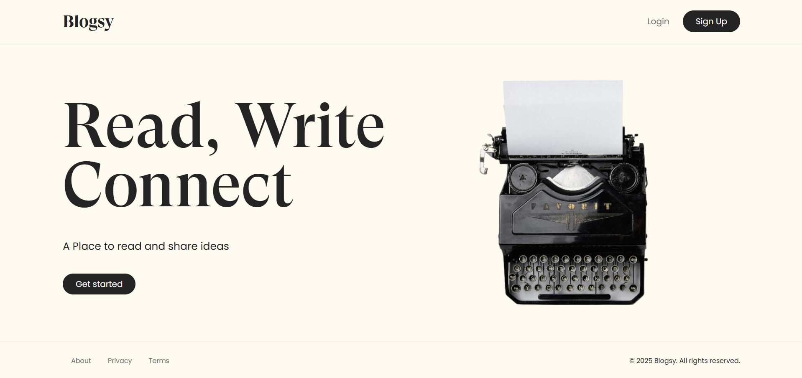
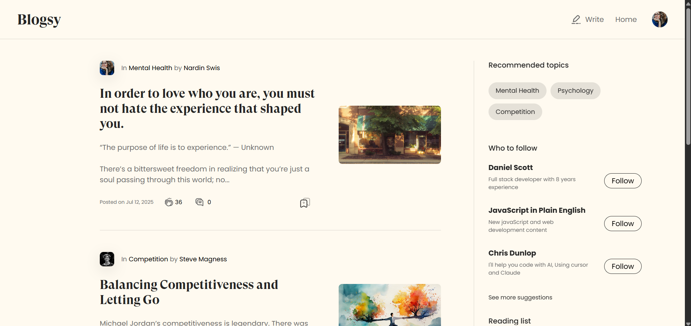

# 📝 Blogsy

**Blogsy** is a full-featured blog platform built with Flask. It allows users to write blog posts with images and tags, like and comment on others’ posts, upload profile pictures, and build a personal reading list — all with a clean, modern interface.

---

## 🖼️ Screenshot

<p align="center">
  
</p>

<p align="center">
  
</p>

---

## 🚀 Features

- 🔐 **Authentication & Users**
  - Register, login, logout
  - Update profile information (name, password)
  - Upload profile image (validated and renamed per user)
  - Profile page via `/your-name`

- ✍️ **Post Creation**
  - Create a blog post with:
    - Title, content, tags (comma-separated), and image
    - Uploaded image is auto-converted and saved as `.webp`
    - Validates minimum content and title length
  - Drop-cap styling on the first letter of blog content

- 🏷️ **Tags & Topics**
  - Automatically link or create tags during post creation
  - View all posts by tag using `/tag/<id>`

- 💬 **Interaction**
  - Add comments to posts (with empty check)
  - Like posts (AJAX-friendly)
  - Save/remove posts to/from reading list (AJAX-friendly)

- 📚 **Reading List**
  - Logged-in users can save any post to a personal reading list
  - Accessible at `/reading-list`

- 📃 **Static Pages**
  - Terms of use (`/terms`)
  - Privacy policy (`/privacy-policy`)
  - About page (`/about`)
  - Welcome page (`/`)

- ⚙️ **Image Upload & Processing**
  - All blog images are converted to `.webp` with compression
  - Profile images are renamed uniquely per user

- 🧠 **Responsive and Accessible**
  - tyled for readability, performance, and clarity
  - Styled with Jinja2 templates + Bootstrap 5 components

- 🧰 **Tech Stack**
  - Flask + Flask-Login + SQLAlchemy
  - Pillow (image processing)
  - HTML/CSS (Bootstrap)


---

## 📂 Project Structure

```bash
blogsy/
├── website/
│   ├── static/
│   │   ├── uploads/
│   │   ├── profile_images/
│   │   ├── js/
│   │   ├── css/
│   │   ├── fonts/
│   │   └── images/
│   ├── templates/
│   ├── __init__.py
│   ├── views.py
│   ├── models.py
│   └── utils.py
├── run.py
├── requirements.txt
└── README.md
```

## 🧰 Tech Stack

- **Backend:** Python, Flask, Flask-Login, SQLAlchemy
- **Frontend:** HTML, Jinja2, Bootstrap 5
- **Image Processing:** Pillow (for WebP compression)
- **Database:** SQLite (for development and simplicity)
